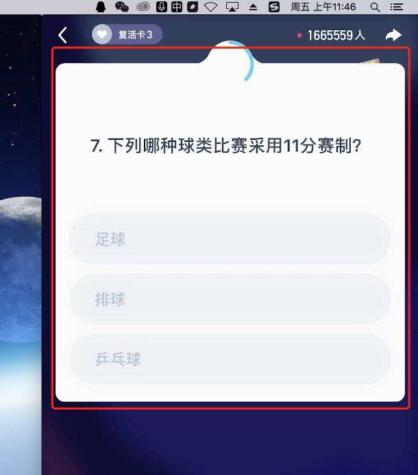
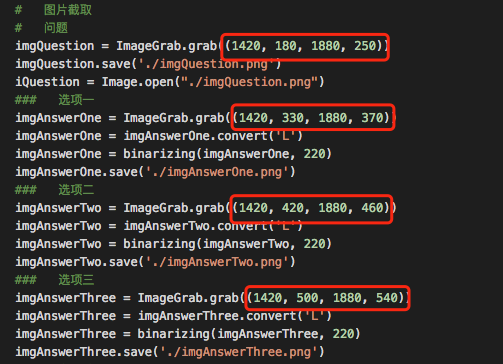
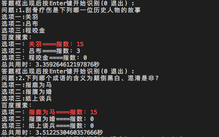

# AnswerAssistant/百万英雄助手

    只需要一个手机屏幕录制软件即可使用。
    通过电脑屏幕截图然后进行图片识别，再百度搜索，得出关键字出现的数量来进行辅助答题。
    如果出现“不”字题型时，因选择出现数量少的答案。

# 安装所需库

    图片识别采用的是本机的OCR，需先安装下载OCR
        brew install tesseract
        下载中文识别包放进/tesseract/3.05.01/share/tessdata'目录下
        https://github.com/tesseract-ocr/tessdata
    python所需库安装
        pip install -r requirements.txt

# 截图

    当前位置
    在屏幕的右上方

    如有需要可手动修改相应参数

# 效果

# License

MIT