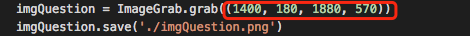

# AnswerAssistant/答题助手/百万英雄、芝士超人、冲顶大会

    只需要一个手机屏幕录制软件即可使用。
    通过电脑屏幕截图然后进行图片识别，再百度搜索，得出关键字出现的数量来进行辅助答题。
    图片识别采用的百度的开发DEMO接口，无需做任何操作即可识别。
    如果出现“不”字题型时，应该选择出现数量少的答案。

# 安装所需库

    python所需库安装
        pip install -r requirements.txt

# 截图

    当前位置
    在屏幕的右上方

    如有需要可手动修改相应参数

# 效果

# License

MIT